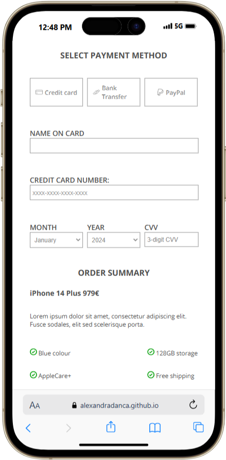
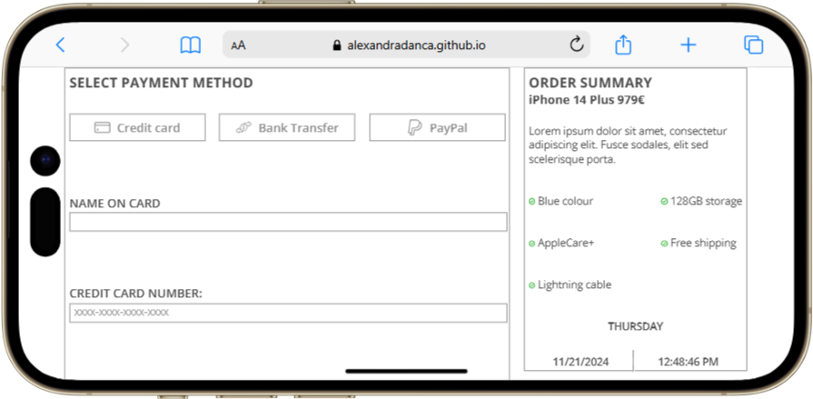
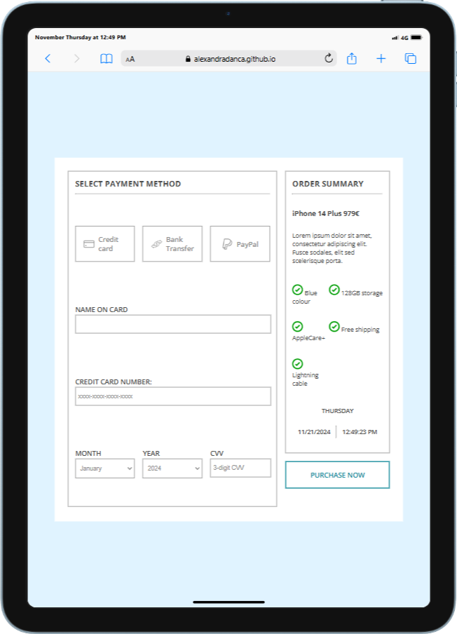
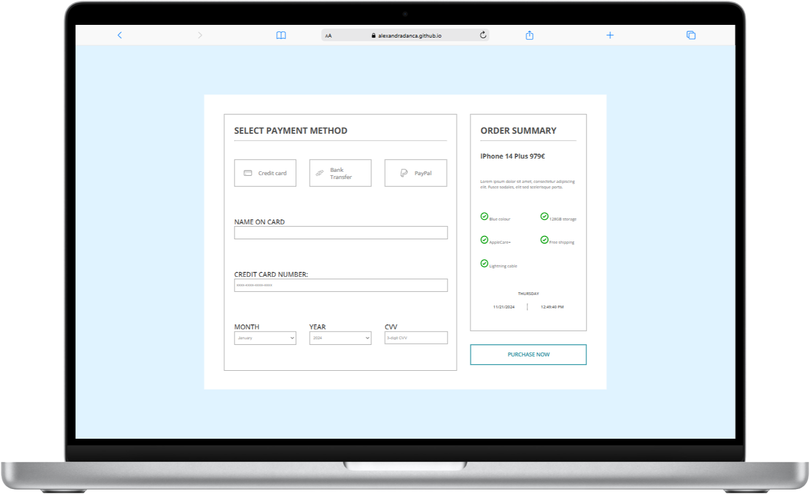

<h2 align="center">
 :money_with_wings: <a href="https://alexandradanca.github.io/-002-CreditCardCheckout/" target="_blank">Credit Card Checkout</a>
</h2>

This is a Checkout page.  It was created during front-end learning journey

## Built With
- HTML
- CSS

## Features

**🎨 Styled just with CSS**

**📱 Fully Responsive**

<h2>Mockups</h2>

 
  
  
  
  

